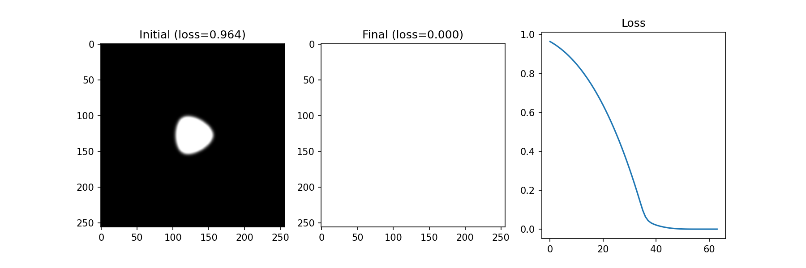

Update (2026) v0.2: Simplified the API, added test coverage, and added new examples.

# jaxsvg

jaxsvg is a simple, differentiable vector graphics library written in `jax.numpy`. It bridges the gap between vector curves and pixels while making the process differentiable.

Rather than sharing all the precision and functionality of more established libraries, `jaxsvg` uses a polyline approximation of Bézier curves and no custom kernels. Here's how it works:

1. Cubic curves are flattened into a set number of line segments (default 32 segments)
2. Each pixel's distance to the nearest line segment is calculated
3. Pixel intensity is based on Gaussian smoothing of the distance field (default smoothness is 2.5% of image dimensions)

**Con**: Because it's an approximation, the gradients are not pixel-perfect.
**Pro**: It's fast, has are no complex build steps, and it can run anywhere that JAX runs.

## Examples

The tests and examples use closed cubic Bézier paths. Quadratic curves or lines could also be modeled, since cubic curves are derived from them.

### Combining shapes

### Optimizing a shape to fill the canvas

### Learning complex and colorful shapes - emojis!

In this example, 24 randomly initialized blobs are optimized directly against a sample from the Noto Emoji library. The flickering is by design: during training, blurriness is intentionally annealed to prevent local minima.

https://github.com/user-attachments/assets/8ee40619-f3d4-41ee-b6a5-6506ac45cde5

